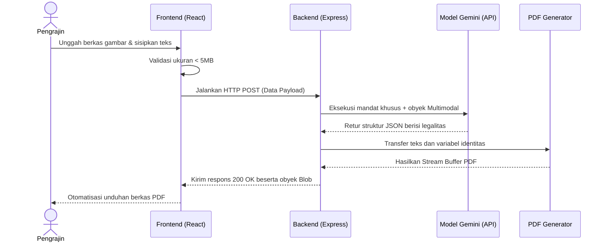

# 🎨 Citraksa AI — Asisten Legal & Kultural Pengrajin Nusantara

<p align="center">
  <strong>Mendigitalkan Pelestarian Budaya Kriya Nusantara & Mempermudah Perlindungan Hukum (HAKI) Secara Instan</strong>
</p>

<p align="center">
  
  
</p>

---

## 🌟 Ringkasan Produk

**Citraksa AI** adalah aplikasi berbasis web cerdas yang memanfaatkan kekuatan **AI Multimodal (Google Gemini)** untuk mengelola siklus pendaftaran Hak Kekayaan Intelektual (HAKI) bagi pengrajin tradisional di Indonesia. 

Aplikasi ini secara otomatis:
1. **Membedah Foto Motif:** Mengidentifikasi warna, bentuk, pola, dan elemen visual khas nusantara dari foto yang diunggah.
2. **Merangkai Narasi Filosofis:** Mengubah penjelasan bahasa sehari-hari dari pengrajin menjadi deskripsi budaya kriya yang kaya, formal, dan baku.
3. **Penyusunan Klausa Hukum HAKI:** Menghasilkan draf argumen hukum perlindungan ciptaan merujuk pada **Undang-Undang No. 28 Tahun 2014 tentang Hak Cipta** secara otomatis dan seketika dalam format dokumen PDF siap cetak.

---

## 🛠️ Tech Stack & Arsitektur

### Teknologi Utama:
* **Frontend:** React.js + Vite + Tailwind CSS (Responsif & Mobile-First)
* **Backend:** Node.js + Express.js
* **AI Engine:** Google AI Studio (Model Gemini 2.5 Flash / Pro)
* **Dokumen Engine:** `pdf-lib` / Modul Generator PDF

### Alur Sistem (Sequence Flow):


---

## ⚙️ Cara Instalasi & Menjalankan Proyek Secara Lokal

### Prasyarat
Pastikan Anda sudah menginstal [Node.js](https://nodejs.org/) (versi 18+) di komputer Anda.

### 1. Clone Repositori & Masuk ke Folder
```bash
git clone https://github.com/username/citraaksa.git
cd citraaksa
```

### 2. Setup Backend & Konfigurasi API Key
Masuk ke direktori backend, instal dependensi, dan atur API Key Anda:
```bash
cd backend
npm install
```

Salin file contoh environment variable:
```bash
cp .env.example .env
```
> [!NOTE]
> Jika Anda menggunakan Windows PowerShell, gunakan perintah berikut untuk menyalin:
> `Copy-Item .env.example .env`

Buka file `.env` baru tersebut, kemudian masukkan API Key Gemini Anda yang didapatkan dari [Google AI Studio](https://aistudio.google.com/):
```ini
PORT=3001
GEMINI_API_KEY=... # API Key Anda di sini
```

Jalankan server backend:
```bash
npm run dev
```
Server akan berjalan di port `3001`.

### 3. Setup Frontend
Buka terminal baru di direktori root `citraaksa`, lalu masuk ke folder frontend:
```bash
cd frontend
npm install
npm run dev
```
Aplikasi frontend akan berjalan secara lokal di browser Anda (biasanya di `http://localhost:5173`).

---

## 🛡️ Keamanan Kredensial (Sangat Penting!)

Untuk memastikan kenyamanan dan keamanan Anda saat mempublikasikan kode ini ke GitHub atau platform publik lainnya:
- File `backend/.env` **telah dimasukkan ke dalam `.gitignore`** sehingga kredensial API Anda tidak akan pernah terunggah ke internet.
- Templat pengganti yang aman telah disediakan dalam file `backend/.env.example`.
- Detail instruksi keamanan lebih lanjut dapat dibaca pada file **[PANDUAN_KEAMANAN.md](file:///c:/Users/Axioo%20Hype%207/Documents/citraaksa/PANDUAN_KEAMANAN.md)**.

---

## ⚖️ Kepatuhan Hukum

Draf dokumen perlindungan hukum yang dihasilkan oleh sistem diselaraskan dengan standar **Undang-Undang Republik Indonesia Nomor 28 Tahun 2014 tentang Hak Cipta**, khususnya Pasal 40 ayat (1) huruf j (karya seni rupa dengan segala bentuk seperti seni lukis, gambar, seni ukir, seni kaligrafi, seni pahat, seni patung, atau seni terapan) dan huruf k (karya seni batik atau seni motif lain).
